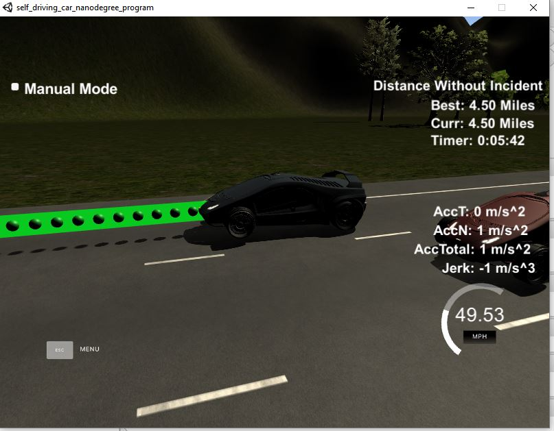
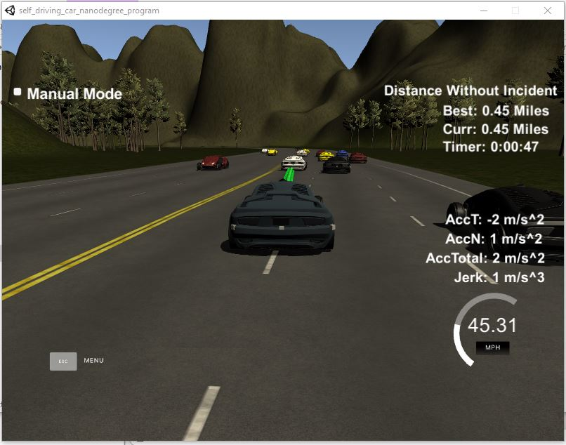

# CarND-Path-Planning-Project
Self-Driving Car Engineer Nanodegree Program
   
### Simulator.
You can download the Term3 Simulator which contains the Path Planning Project from the [releases tab (https://github.com/udacity/self-driving-car-sim/releases/tag/T3_v1.2).

### Goals
In this project your goal is to safely navigate around a virtual highway with other traffic that is driving +-10 MPH of the 50 MPH speed limit. You will be provided the car's localization and sensor fusion data, there is also a sparse map list of waypoints around the highway. The car should try to go as close as possible to the 50 MPH speed limit, which means passing slower traffic when possible, note that other cars will try to change lanes too. The car should avoid hitting other cars at all cost as well as driving inside of the marked road lanes at all times, unless going from one lane to another. The car should be able to make one complete loop around the 6946m highway. Since the car is trying to go 50 MPH, it should take a little over 5 minutes to complete 1 loop. Also the car should not experience total acceleration over 10 m/s^2 and jerk that is greater than 10 m/s^3.

#### The map of the highway is in data/highway_map.txt
Each waypoint in the list contains  [x,y,s,dx,dy] values. x and y are the waypoint's map coordinate position, the s value is the distance along the road to get to that waypoint in meters, the dx and dy values define the unit normal vector pointing outward of the highway loop.

The highway's waypoints loop around so the frenet s value, distance along the road, goes from 0 to 6945.554.

## Basic Build Instructions

1. Clone this repo.
2. Make a build directory: `mkdir build && cd build`
3. Compile: `cmake .. && make`
4. Run it: `./path_planning`.

Here is the data provided from the Simulator to the C++ Program

#### Main car's localization Data (No Noise)

["x"] The car's x position in map coordinates

["y"] The car's y position in map coordinates

["s"] The car's s position in frenet coordinates

["d"] The car's d position in frenet coordinates

["yaw"] The car's yaw angle in the map

["speed"] The car's speed in MPH

#### Previous path data given to the Planner

//Note: Return the previous list but with processed points removed, can be a nice tool to show how far along
the path has processed since last time. 

["previous_path_x"] The previous list of x points previously given to the simulator

["previous_path_y"] The previous list of y points previously given to the simulator

#### Previous path's end s and d values 

["end_path_s"] The previous list's last point's frenet s value

["end_path_d"] The previous list's last point's frenet d value

#### Sensor Fusion Data, a list of all other car's attributes on the same side of the road. (No Noise)

["sensor_fusion"] A 2d vector of cars and then that car's [car's unique ID, car's x position in map coordinates, car's y position in map coordinates, car's x velocity in m/s, car's y velocity in m/s, car's s position in frenet coordinates, car's d position in frenet coordinates. 

## Details

1. The car uses a perfect controller and will visit every (x,y) point it recieves in the list every .02 seconds. The units for the (x,y) points are in meters and the spacing of the points determines the speed of the car. The vector going from a point to the next point in the list dictates the angle of the car. Acceleration both in the tangential and normal directions is measured along with the jerk, the rate of change of total Acceleration. The (x,y) point paths that the planner recieves should not have a total acceleration that goes over 10 m/s^2, also the jerk should not go over 50 m/s^3. (NOTE: As this is BETA, these requirements might change. Also currently jerk is over a .02 second interval, it would probably be better to average total acceleration over 1 second and measure jerk from that.

2. There will be some latency between the simulator running and the path planner returning a path, with optimized code usually its not very long maybe just 1-3 time steps. During this delay the simulator will continue using points that it was last given, because of this its a good idea to store the last points you have used so you can have a smooth transition. previous_path_x, and previous_path_y can be helpful for this transition since they show the last points given to the simulator controller with the processed points already removed. You would either return a path that extends this previous path or make sure to create a new path that has a smooth transition with this last path.

## Compilation

### The code compiles correctly.

No changes were made in the cmake configuration. A new file was added [src/spline.h](./scr/spline.h). It is the [Cubic Spline interpolation implementation](http://kluge.in-chemnitz.de/opensource/spline/): a single .h file you can use splines instead of polynomials. It was a great suggestion from the classroom QA video. It works great.

## Valid trajectories

### The car is able to drive at least 4.32 miles without incident.
I ran the simulator for 4.5 miles without incidents:

### The car drives according to the speed limit.
No speed limit red message

### Max Acceleration and Jerk are not Exceeded.
Max jerk red message.

### Car does not have collisions.
No collisions.

### The car stays in its lane, except for the time between changing lanes.
The car stays in its lane most of the time except changing lanes or due to traffic.

### The car is able to change lanes
Chaning lanes when a low spped car is in front of the car and it is safe to change.

## Reflection

Most of the codes are copied from the seed project, two separated subroutines are defined for the the purpose of changing lanes:

- vector< bool > check_lane_is_safe (int lane, int prev_size, double car_s, double car_speed, double max_s, vector< vector< double> > sensor_fusion)
- int change_lane(int current_lane, int prev_size, double car_s, double car_speed, double max_s, vector< vector< double> > sensor_fusion)

### Check the safty of changing lanes:
By dealing with the telemetry and sensor fusion data, the algorithem intends to check the safty through three steps:

- Any car in front of us blocking the traffic.
- Any car to the right of our current lane is within the dangerous range.
- Any car to the left of our current lanes is within the dangerous range.

To consider it as "dangerous" if its distance to our car is less than 30 meters in front or behind us.

### Decision to make

Based on the prediction, our car will increases the speed, decrease speed, or make a lane change when it is safe. 

